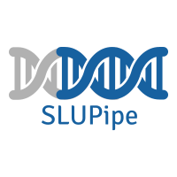

# SLUPipe: A (S)omatic Ana(L)ysis (U)mbrella (Pipe)line 

**Table of Contents**

[TOC]

### Description

SLUPipe is a Bioinformatics Pipeline based on NIH & GDC guidelines focused towards automating and hastening the GDC's DNA-Sequencing  Analysis Pipeline proposal. SLUPipe automates and aggreagates the workflows for aligned BAM files as described by the National Cancer Institute:

###FlowChart

```flow
st=>start: Login
op=>operation: Login operation
cond=>condition: Successful Yes or No?
e=>end: To admin

st->op->cond
cond(yes)->e
cond(no)->op


(Somatic Variant Calling, Variant Annotation, Mutation Aggregation &  )


### Installation 

**1. Download Anacaonda 4.5+**
**2. Create an Anaconda Environment which uses Python3.6.8 as default:**
```console
conda create -n SLUPipe python=3.6
```
**3. Activate the Anaconda Environment:**
```console
source activate SLUPipe
```
**4. The NGS Pipeline will require the following Python packages for it to be fully functionable:**

**biobambam-2.0.87**
```console
conda install -c bioconda biobambam 
```
**bwa.kit-0.7.15**
```console
conda install -c bioconda bwakit 
```
**ensembl-vep 95.3**
``` console
conda install -c bioconda ensembl-vep=95.3 
```
**GenomeAnalysisTK-3.8.0**
``` console
conda install -c bioconda gatk
```
**MuSE 1.0.rc**
``` console
conda install -c bioconda muse 
```
**pandas 0.24.2**
``` console
conda install -c anaconda pandas 
```
**pindel-0.2.5b9**
``` console
conda install -c bioconda pindel 
```
**platypus-opt 1.0.3**
``` console
conda install -c bioconda platypus-variant 
```
**psycopg2 - 2.7.6.1**
``` console
conda install -c anaconda psycopg2 
```
**samtools-1.9**
``` console 
conda install -c bioconda samtools
```
**strelka 2.9.10**
``` console
conda install -c bioconda strelka 
```
**somatic-sniper 1.0.5.0**
``` console
conda install -c bioconda somatic-sniper 
```
**varscan - 2.4.3.2**
``` console
conda install -c bioconda varscan 
```
**vcf2maf - 1.6.16**
``` console
conda install -c bioconda vcf2maf
```

**5. Configuring Ensembl VEP For Variant Annotation & MAF Conversion (Local Cache Installation):**
   1. Create .vep directory to store offline cache: mkdir ~/.vep
   2. cd $HOME/.vep
   3. curl -O ftp://ftp.ensembl.org/pub/release-95/variation/indexed_vep_cache/homo_sapiens_vep_95_GRCh38.tar.gz
   4. tar xzf homo_sapiens_vep_96_GRCh38.tar.gz


**IMPORTANT**

 VCF2MAF May Downgrade Samtools 1.9 to 1.7  causing issues. Reinstall Samtools (1.9) to solve. 


### Usage

1. **Activate Anaconda Environment**
``` console
source activate SLUPipe
```
2. **TUMOR MODE:** Place Tumor .bam files in **tumor mode directory** (input/tumor_mode).
3. **NORMAL MODE:** Place Normal & Tumor .bam files in **normal mode directory** (input/normal_mode).
4. **CONFIGURATION FILE**:
    1. Variant Callers: Set Variant Callers for Workflow
    2. Chromosome Range: Set Chromosome Range Used for Workflow
    3. Input Directory: Set Input Directory Filepath
    4. VEP Script & Cache Directory: Set Script & Cache Directory Filepath
5. **Pipeline Execution**
    
```console
python3 NGS.py
```


